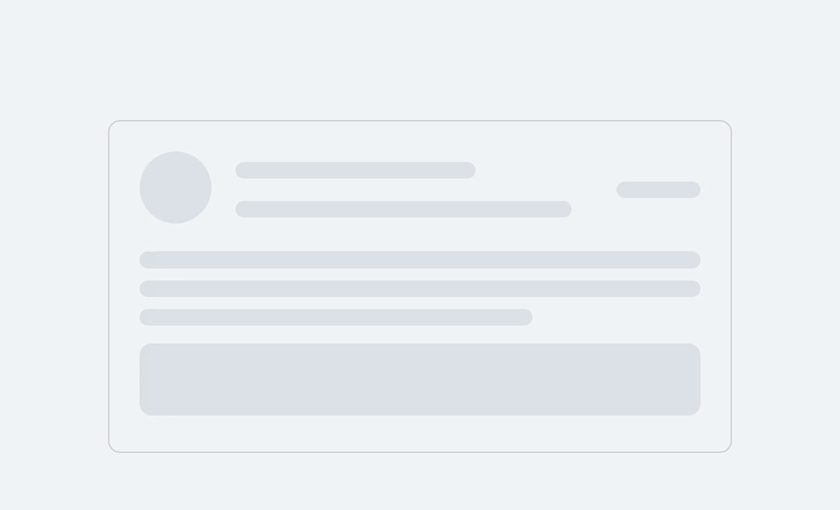
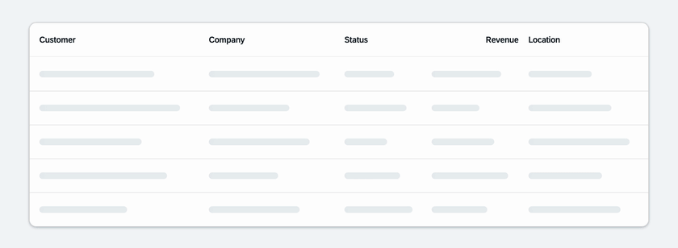
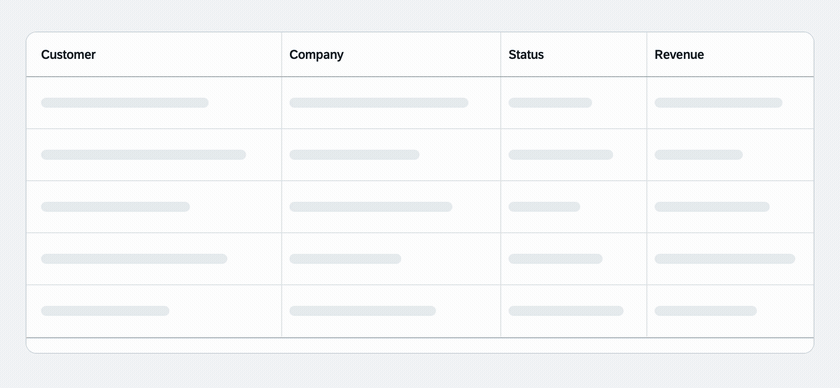
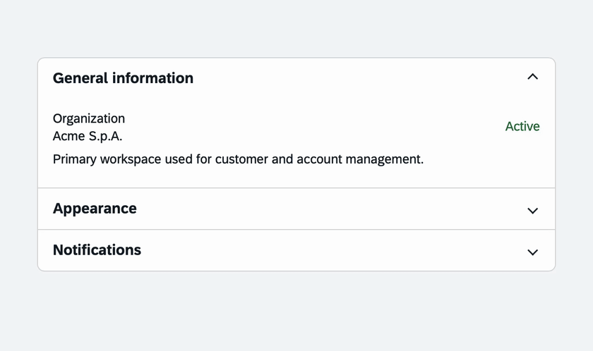
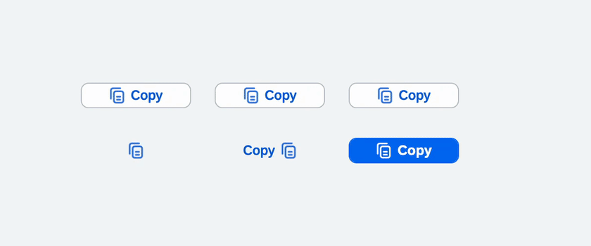
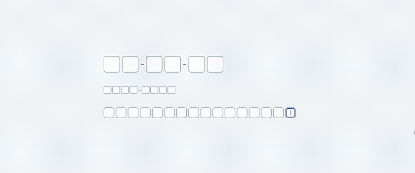

# UI5X

[](https://github.com/rdisomma/ui5x/actions/workflows/ci.yml)

Advanced controls for OpenUI5 and SAPUI5.

**[Open the live demo](https://rdisomma.github.io/ui5x/)** to see every control and have fun
customising how each one behaves.

The standard libraries stop at the building blocks, so anything composed from them gets rebuilt
in every project. UI5X ships those compositions as controls, with the theming, accessibility and
state handling already done.

Each one extends `sap.ui.core.Control` or the standard control it specialises. None of them touch
a private API. You declare and bind them from XML views, JavaScript or TypeScript.

> UI5X is in early development. APIs may change before version 1.0.

## Features

- **[`Skeleton`](#skeleton)** — a placeholder in the shape of the content you are waiting for: a paragraph of
  lines, a block, or an avatar disc. Animated by default, hidden from screen readers, and styled
  with UI5 theme parameters so it follows the active theme.
- **[`LoadingContainer`](#loadingcontainer)** — swaps between a placeholder and the real content: bind `loading` to a
  model flag and the container does the switch for you, with no manual visibility juggling. It
  ships with a built-in skeleton and accepts any UI5 control as a custom placeholder when the
  default does not match your layout.
- **[`LoadingResponsiveTable`](#loadingresponsivetable)** — wraps a responsive `sap.m.Table` and replaces its rows with
  matching skeleton cells while data is loading. It supports fixed and viewport-filling row counts.
- **[`LoadingTable`](#loadingtable)** — wraps a grid `sap.ui.table.Table` and renders a matching, presentation-only
  table with skeleton cells while data is loading.
- **[`Accordion`](#accordion)** — groups `AccordionItem` sections with single or multiple expansion. Items can
  contain any UI5 control and support disabled or non-toggleable states.
- **[`CopyButton`](#copybutton)** — copies a value to the system clipboard and confirms success with a temporary
  icon, text and button type while preserving the original state.
- **[`SegmentedInput`](#segmentedinput)** — collects numeric or alphanumeric identifiers in separate fields, with
  optional grouping, three sizes, value-state feedback, paste support and a Fiori clear action.
- **[`ChatFeed`](#chatfeed)** — combines a configurable message composer with a bindable conversation. Messages
  can be aligned by current user, grouped by date and expose edit or delete actions.
- **Accessibility-aware** — loading containers expose `aria-busy`, skeleton content is kept out
  of the accessibility tree, and animations respect `prefers-reduced-motion`. The interactive
  controls implement the UI5 focus and labelling contracts (`getFocusDomRef`, `getIdForLabel`,
  `getAccessibilityInfo`), so `focus()` and a `sap.m.Label` behave as they do on a standard
  control.
- **Theme coverage** — the `sap_horizon` and `sap_fiori_3` families, each in light, dark and both
  high-contrast variants, with the right-to-left stylesheets generated alongside them. The
  high-contrast themes replace the subtle tints of the standard palettes so placeholders stay
  above the 3:1 contrast ratio instead of disappearing into the background.
- **Verified on every change** — the QUnit suite runs headless in CI against the lowest supported
  Node.js versions and the current LTS, together with the type check, the generated interfaces
  and a full library build.
- **TypeScript first** — written in TypeScript and shipped with type definitions, while remaining
  fully usable from JavaScript applications. Built with UI5 CLI 4 for OpenUI5 and SAPUI5.

## Compatibility

- Developed against OpenUI5 `1.151.0`, and tested with SAPUI5 `1.151.0` in SAP Business
  Application Studio. Older UI5 versions have not been validated yet
- Themes: `sap_horizon`, `sap_horizon_dark`, `sap_horizon_hcb`, `sap_horizon_hcw`,
  `sap_fiori_3`, `sap_fiori_3_dark`, `sap_fiori_3_hcb`, `sap_fiori_3_hcw`.
  Any other theme falls back to the base theme

## Installation

```bash
npm install @raffaeledisomma/ui5x
```

**1.** In `manifest.json`, add two entries to the `sap.ui5` section the application already has,
as siblings of each other:

- `dependencies.libs` declares UI5X, so the runtime loads it with the component
- `resourceRoots` tells UI5 where the library is served from

```json
{
  "sap.ui5": {
    "dependencies": {
      "libs": {
        "ui5x": {}
      }
    },
    "resourceRoots": {
      "ui5x": "./thirdparty/ui5x/"
    }
  }
}
```

**2.** TypeScript projects only — name the package in `tsconfig.json`:

```json
{
  "compilerOptions": {
    "types": ["@openui5/types", "@raffaeledisomma/ui5x"]
  }
}
```

That is everything a locally previewed application needs. Before deploying it you have to add two
build settings as well, described in
[Deploying an application that uses UI5X](#deploying-an-application-that-uses-ui5x).

<details>
<summary><b>Applications that boot from <code>index.html</code> without a component</b></summary>

Such an application never reads `manifest.json`, so the same mapping goes on the bootstrap tag
instead:

```html
<script
  id="sap-ui-bootstrap"
  src="resources/sap-ui-core.js"
  data-sap-ui-resource-roots='{"ui5x": "/thirdparty/ui5x/"}'>
</script>
```

</details>

<details>
<summary><b>Why both manifest entries are required</b></summary>

Without them the application starts and fails on the first control with
`ModuleError: failed to load 'ui5x/library.js'`.

`resourceRoots` is the one easy to leave out: it tells UI5 where the library lives. UI5X is served
from `/thirdparty/ui5x/` rather than from `/resources/`, which a SAP Fiori tools project reserves
for the SAPUI5 runtime: a proxy claims it during local preview, and a route forwards it to SAP's
servers once deployed. Serving UI5X from its own path means neither has to be reconfigured and
neither can intercept the library, and it is also what makes the library resolve in SAP Build Work
Zone, where the UI5 runtime is loaded by the shell.

</details>

<details>
<summary><b>What the <code>types</code> entry changes</b></summary>

The control interfaces are declared as module augmentations, which TypeScript loads only when the
package is named in the compiler's `types`. Without that entry the imports still resolve and
nothing appears to be missing, but the controls come out bare: a settings object is rejected and
every generated getter is reported as absent.

</details>

<details>
<summary><b>What installing adds, and which UI5 libraries have to be available</b></summary>

UI5X has no npm dependencies of its own, so installing it adds one package and nothing else.
The package carries the built library, its type definitions and the `-dbg.js` variants UI5 loads
with `sap-ui-debug=true`; the TypeScript sources are not shipped. Whatever `npm audit` reports
afterwards comes from the application's own dependency tree, not from here.

UI5X declares `sap.ui.core` alone, because it is the only library every control needs:

| Library        | Declared | Required by |
| -------------- | -------- | ----------- |
| `sap.ui.core`  | yes | Every control |
| `sap.m`        | no  | `CopyButton` (which extends `sap.m.Button`), `ChatFeed`, `ChatMessage`, `SegmentedInput`, `LoadingResponsiveTable` |
| `sap.ui.table` | no  | `LoadingTable` only |

The other two are imported by the controls that use them, so they are requested when one of those
controls is loaded and not before: an application built only from `Skeleton`, `LoadingContainer`,
`Accordion` or `LoadingTable` never loads `sap.m`, and one that uses no grid table never loads
`sap.ui.table`.

Where the UI5 runtime comes from decides whether anything else is needed. A SAP Fiori tools
project proxies `/resources` to `https://ui5.sap.com` and has the whole runtime available, so
every library resolves whether or not it is named anywhere. A project that lets the UI5 tooling
serve `/resources` gets only what its own `framework` section lists, plus what those libraries
depend on, and `sap.ui.table` is the one `LoadingTable` needs there. An application using that
control declares it regardless, since the table it passes in is a `sap.ui.table.Table`.

</details>

## Deploying an application that uses UI5X

Nothing is needed for local preview: `npm start` serves the library from the dependency graph.
For a deployment, add both of the following. For a SAP Fiori tools project they often belong in
`ui5-deploy.yaml` rather than `ui5.yaml`, whichever configuration the build actually uses.

```yaml
builder:
  settings:
    includeDependency:
      - ui5x
  customTasks:
    - name: ui5-task-zipper
      afterTask: generateCachebusterInfo
      configuration:
        includeDependencies: true
```

<details>
<summary><b>What these two settings do, and what is missing without each</b></summary>

| Setting | Needed for | Symptom when missing |
| ------- | ---------- | -------------------- |
| `includeDependency` | any deployment | `dist` contains no `thirdparty/ui5x` |
| `includeDependencies` | Cloud Foundry | the archive contains no `thirdparty/ui5x` |

`ui5 build` only writes the application's own files unless the library is declared as a build
dependency, which is what `includeDependency` does. If the project then packages itself with
`ui5-task-zipper`, the archive holds the application's own files only until `includeDependencies`
is set. The two options are one letter apart and both are required.

</details>

### Checking that the library was deployed

Neither command changes anything. The first should print the matching line from the archive, the
second a status line ending in `200`:

```bash
unzip -l dist/<archive>.zip | grep "thirdparty/ui5x/library.js"
curl -sI https://<application-url>/thirdparty/ui5x/library.js | head -1
```

No output from `grep` means the archive was built without the library, so one of the two settings
above is missing. A status other than `200` means the library never reached the server. A `200`
means the deployment carries it, whether or not the application itself works.

## Controls and API reference

One section per control: what it does, the full table of its properties, aggregations and events,
then examples in JavaScript and in XML.

### Skeleton

A `Line` skeleton stacks `lines` bars and shortens the last one to look like a paragraph;
`Rectangle` fills the available width; `Circle` uses `width` as its diameter.


| Property   | Type                     | Default  | Description                                                                 |
| ---------- | ------------------------ | -------- | --------------------------------------------------------------------------- |
| `width`    | `sap.ui.core.CSSSize`    | `null`   | Width of the skeleton, e.g. `"100%"`, `"20rem"`, `"320px"`.                  |
| `height`   | `sap.ui.core.CSSSize`    | `null`   | Height of the skeleton. Only applies to type `Rectangle`: a line takes its height from `lines`, a circle from its width. |
| `type`     | `ui5x.loading.SkeletonType` | `Line` | Visual shape: `Line`, `Rectangle` or `Circle`.                              |
| `lines`    | `int`                    | `1`      | Number of placeholder lines. Values outside 1–3 are clamped. Only applies to type `Line`. |
| `animated` | `boolean`                | `true`   | Shimmer animation. Also stops when the system requests reduced motion.       |

#### Examples

```js
sap.ui.require(["ui5x/loading/Skeleton"], function (Skeleton) {
  new Skeleton({
    type: "Line",
    lines: 3,
    width: "20rem",
    animated: true
  }).placeAt("content");
});
```

In XML views:

```xml
<mvc:View
  xmlns:mvc="sap.ui.core.mvc"
  xmlns:loading="ui5x.loading">

  <loading:Skeleton type="Circle" width="3rem" />

</mvc:View>
```

### LoadingContainer

A container that swaps between a placeholder and its real content: it renders the placeholder
while `loading` is `true`, and its `content` otherwise. Only one of the two is in the DOM at a
time, so `loading` can be bound directly to a model flag.



| Property        | Type                        | Default | Description                                                         |
| --------------- | --------------------------- | ------- | ------------------------------------------------------------------- |
| `loading`       | `boolean`                   | `false` | Show the placeholder instead of the content.                        |
| `skeletonType`  | `ui5x.loading.SkeletonType` | `Line`  | Type of the default skeleton. Ignored when `placeholder` is set.    |
| `skeletonLines` | `int`                       | `1`     | Lines of the default skeleton (clamped to 1–3). Ignored when `placeholder` is set. |
| `skeletonHeight`| `sap.ui.core.CSSSize`       | `null`  | Height of the default skeleton, used only by type `Rectangle`. Ignored when `placeholder` is set. |
| `animated`      | `boolean`                   | `true`  | Animate the default skeleton. Ignored when `placeholder` is set.    |
| `width`         | `sap.ui.core.CSSSize`       | `null`  | Width of the container. Inherits the width of its parent when unset. |

| Aggregation   | Type                   | Cardinality | Description                                                    |
| ------------- | ---------------------- | ----------- | -------------------------------------------------------------- |
| `content`     | `sap.ui.core.Control`  | 0..1        | Default aggregation. Displayed when `loading` is `false`.       |
| `placeholder` | `sap.ui.core.Control`  | 0..1        | Custom placeholder — any control, e.g. skeletons composed in a `VBox`. Falls back to the built-in `Skeleton`. |

#### Examples

```js
sap.ui.require([
  "ui5x/loading/LoadingContainer",
  "sap/m/Text"
], function (LoadingContainer, Text) {
  const oContainer = new LoadingContainer({
    loading: true,
    skeletonType: "Line",
    skeletonLines: 3,
    content: new Text({ text: "Loaded content" })
  });

  oContainer.placeAt("content");

  // later, when data has arrived
  oContainer.setLoading(false);
});
```

With a custom placeholder:

```xml
<loading:LoadingContainer
  loading="{ui>/busy}"
  xmlns:loading="ui5x.loading"
  xmlns:m="sap.m">

  <loading:placeholder>
    <loading:Skeleton
      type="Rectangle"
      width="20rem" />
  </loading:placeholder>

  <m:Text text="Loaded content" />

</loading:LoadingContainer>
```

### LoadingResponsiveTable

`LoadingResponsiveTable` wraps a `sap.m.Table`. While `loading` is `true`, it renders a matching
table with cloned columns and skeleton cells; when loading finishes, it renders the original table
and its bound items.



`Fixed` mode always renders `skeletonRows`. `Fill` mode calculates how many rows fit between the
table and the bottom of the viewport, using `skeletonRows` as the initial fallback and
`maxSkeletonRows` as the upper limit.

| Property                | Type                           | Default | Description                                           |
| ----------------------- | ------------------------------ | ------- | ----------------------------------------------------- |
| `loading`               | `boolean`                      | `false` | Show skeleton rows instead of the original table.     |
| `skeletonRows`          | `int`                          | `5`     | Rows rendered in `Fixed` mode and fallback for `Fill`. |
| `maxSkeletonRows`       | `int`                          | `10`    | Maximum rows calculated in `Fill` mode.               |
| `skeletonRowsMode`      | `ui5x.loading.SkeletonRowMode` | `Fixed` | Row-count strategy: `Fixed` or `Fill`.                |
| `skeletonRowHeight`     | `sap.ui.core.CSSSize` | `""`      | Height of every skeleton row. `sap.m.Table` sizes rows on their content, so skeleton rows are shorter than rows carrying data and the table grows when it arrives; set this to the height the application rows end up with. |
| `dynamicSkeletonWidths` | `boolean`                      | `false` | Vary skeleton widths across cells.                    |
| `animated`              | `boolean`                      | `true`  | Enable the skeleton shimmer animation.                |

| Aggregation | Type          | Cardinality | Description                                      |
| ----------- | ------------- | ----------- | ------------------------------------------------ |
| `table`     | `sap.m.Table` | 0..1        | Default aggregation containing the actual data. |

#### Example

```xml
<mvc:View
  xmlns:mvc="sap.ui.core.mvc"
  xmlns:loading="ui5x.loading"
  xmlns:m="sap.m">

  <loading:LoadingResponsiveTable
    loading="{ui>/busy}"
    skeletonRowsMode="Fill"
    skeletonRows="5"
    maxSkeletonRows="10"
    dynamicSkeletonWidths="true">

    <m:Table items="{/rows}">
      <m:columns>
        <m:Column>
          <m:Text text="Name" />
        </m:Column>
        <m:Column>
          <m:Text text="Company" />
        </m:Column>
      </m:columns>

      <m:items>
        <m:ColumnListItem>
          <m:cells>
            <m:Text text="{name}" />
            <m:Text text="{company}" />
          </m:cells>
        </m:ColumnListItem>
      </m:items>
    </m:Table>

  </loading:LoadingResponsiveTable>

</mvc:View>
```

### LoadingTable

`LoadingTable` provides the same loading experience for a grid `sap.ui.table.Table`. While
`loading` is `true`, it renders an internal table with matching columns and skeleton rows. The
original table, its row binding and its application data remain untouched.



`Fixed` mode always renders `skeletonRows`. `Fill` mode calculates how many rows fit between the
table and the bottom of the viewport, using `skeletonRows` as the initial fallback and
`maxSkeletonRows` as the upper limit.

| Property                | Type                           | Default | Description                                            |
| ----------------------- | ------------------------------ | ------- | ------------------------------------------------------ |
| `loading`               | `boolean`                      | `false` | Show skeleton rows instead of the original table.      |
| `skeletonRows`          | `int`                          | `5`     | Rows rendered in `Fixed` mode and fallback for `Fill`. |
| `maxSkeletonRows`       | `int`                          | `10`    | Maximum rows calculated in `Fill` mode.                |
| `skeletonRowsMode`      | `ui5x.loading.SkeletonRowMode` | `Fixed` | Row-count strategy: `Fixed` or `Fill`.                 |
| `dynamicSkeletonWidths` | `boolean`                      | `false` | Vary skeleton widths across cells.                     |
| `animated`              | `boolean`                      | `true`  | Enable the skeleton shimmer animation.                 |

| Aggregation | Type                 | Cardinality | Description                                      |
| ----------- | -------------------- | ----------- | ------------------------------------------------ |
| `table`     | `sap.ui.table.Table` | 0..1        | Default aggregation containing the actual data. |

#### Example

```xml
<mvc:View
  xmlns:mvc="sap.ui.core.mvc"
  xmlns:loading="ui5x.loading"
  xmlns:m="sap.m"
  xmlns:t="sap.ui.table">

  <loading:LoadingTable
    loading="{ui>/busy}"
    skeletonRowsMode="Fixed"
    skeletonRows="5"
    maxSkeletonRows="10"
    dynamicSkeletonWidths="true">

    <t:Table
      rows="{/rows}"
      visibleRowCount="5"
      visibleRowCountMode="Fixed">

      <t:columns>
        <t:Column width="15rem">
          <m:Label text="Customer" />
          <t:template>
            <m:Text text="{name}" />
          </t:template>
        </t:Column>

        <t:Column width="13rem">
          <m:Label text="Company" />
          <t:template>
            <m:Text text="{company}" />
          </t:template>
        </t:Column>
      </t:columns>

    </t:Table>

  </loading:LoadingTable>

</mvc:View>
```

### Accordion

`Accordion` displays a collection of expandable `AccordionItem` sections. By default, expanding
one item collapses the other toggleable items. Set `multipleExpansion` to `true` to allow several
sections to remain open at the same time.



| `Accordion` property | Type                  | Default | Description                                      |
| -------------------- | --------------------- | ------- | ------------------------------------------------ |
| `multipleExpansion`  | `boolean`             | `false` | Allow more than one item to be expanded.         |
| `width`              | `sap.ui.core.CSSSize` | `null`  | Width of the accordion, such as `"100%"`.        |

| `AccordionItem` property | Type      | Default | Description                                             |
| ------------------------ | --------- | ------- | ------------------------------------------------------- |
| `title`                  | `string`  | `""`    | Text displayed in the item header.                      |
| `expanded`               | `boolean` | `false` | Whether the content is expanded.                        |
| `toggleable`             | `boolean` | `true`  | Whether user and accordion logic may change the state.  |
| `enabled`                | `boolean` | `true`  | Whether the item can be toggled through user input.     |

| API          | Type                   | Description                                             |
| ------------ | ---------------------- | ------------------------------------------------------- |
| `items`      | `AccordionItem[]`      | Default aggregation containing the accordion sections. |
| `itemToggle` | Event                  | Fired after an item is toggled through user input.      |

#### Example

```xml
<mvc:View
  xmlns:mvc="sap.ui.core.mvc"
  xmlns:layout="ui5x.layout"
  xmlns:m="sap.m">

  <layout:Accordion
    width="30rem"
    multipleExpansion="false"
    itemToggle=".onItemToggle">

    <layout:AccordionItem
      title="General information"
      expanded="true">
      <m:Text text="Content of the first section" />
    </layout:AccordionItem>

    <layout:AccordionItem title="Details">
      <m:VBox>
        <m:Label
          text="Company name"
          labelFor="companyName" />
        <m:Input
          id="companyName"
          value="{/company/name}"
          width="100%" />
        <m:HBox class="sapUiSmallMarginTop">
          <m:Button
            text="Save"
            type="Emphasized"
            press=".onSave" />
          <m:Button
            text="Cancel"
            press=".onCancel"
            class="sapUiTinyMarginBegin" />
        </m:HBox>
      </m:VBox>
    </layout:AccordionItem>

    <layout:AccordionItem
      title="Always expanded"
      expanded="true"
      toggleable="false">
      <m:Text text="This section cannot be collapsed" />
    </layout:AccordionItem>

  </layout:Accordion>

</mvc:View>
```

### CopyButton

`CopyButton` extends `sap.m.Button` with clipboard support and visual success feedback. The
feedback is shown only after the value has been copied successfully, then the original icon, text
and button type are restored automatically.



When `successType` or `errorType` is omitted, the button keeps its current `type`. Set
`successIcon` or `errorIcon` to an empty string to keep the original icon during feedback.

Clipboard access requires a secure context and a press initiated by the user, and the write is
asynchronous, so it can fail after the press succeeded. The failure shows on the button and
reaches the application through `copyError`; without either, a copy that never happened looks
exactly like one that did.

| Property      | Type                  | Default                | Description                                                    |
| ------------- | --------------------- | ---------------------- | -------------------------------------------------------------- |
| `value`       | `string`              | `""`                   | Value written to the system clipboard.                         |
| `successIcon` | `sap.ui.core.URI`     | `sap-icon://accept`    | Temporary success icon. An empty value preserves the icon.     |
| `successText` | `string`              | `""`                   | Temporary text, applied only when the button already has text. |
| `successType` | `sap.m.ButtonType`    | Current button `type`  | Temporary type. An explicitly configured value takes priority. |
| `errorIcon`   | `sap.ui.core.URI`     | `sap-icon://error`     | Temporary icon when the write fails. Set by default, because nothing else on screen would say so. |
| `errorText`   | `string`              | `""`                   | Temporary text on failure, applied only when the button already has text. |
| `errorType`   | `sap.m.ButtonType`    | Current button `type`  | Temporary type on failure. An explicitly configured value takes priority. |

| Event         | Parameters                        | Description                                             |
| ------------- | --------------------------------- | -------------------------------------------------------- |
| `copySuccess` | `value: string`                   | Fired once the value has reached the clipboard.           |
| `copyError`   | `value: string`, `reason: string` | Fired when the write failed, which `press` cannot report. |

#### Examples

```js
sap.ui.require(["ui5x/button/CopyButton"], function (CopyButton) {
  new CopyButton({
    value: "npm i @raffaeledisomma/ui5x",
    text: "Copy",
    successText: "Copied",
    successType: "Accept"
  }).placeAt("content");
});
```

In XML views:

```xml
<mvc:View
  xmlns:mvc="sap.ui.core.mvc"
  xmlns:button="ui5x.button">

  <button:CopyButton
    value="{invoice>/id}"
    text="Copy ID"
    successText="Copied"
    successType="Accept" />

</mvc:View>
```

### SegmentedInput

`SegmentedInput` collects a fixed-length value in individual fields. It supports numeric codes
such as PINs and one-time passwords, as well as alphanumeric identifiers such as fiscal codes,
license keys, VINs and IBANs. Pasted content is distributed across the segments automatically.



The exposed `value` is always a string, including in `Numeric` mode, so leading zeroes are
preserved. `Medium` matches the standard `sap.m.Input` height; `Small` is suitable for compact
forms and `Large` emphasizes short verification codes.

| Property            | Type                               | Default   | Description                                                       |
| ------------------- | ---------------------------------- | --------- | ----------------------------------------------------------------- |
| `segmentCount`            | `int`                              | `6`       | Number of segments, clamped between 1 and 34.                     |
| `inputType`         | `ui5x.input.SegmentedInputType`    | `Numeric` | Accepted characters: `Numeric` or `Alphanumeric`.                 |
| `size`              | `ui5x.input.SegmentedInputSize`    | `Medium`  | Segment size: `Small`, `Medium` or `Large`.                       |
| `value`             | `string`                           | `""`      | Current normalized value, limited to the configured segment count. |
| `showSeparators`    | `boolean`                          | `false`   | Display visual separators between groups.                        |
| `separatorInterval` | `int`                              | `3`       | Number of segments in each group; values below 1 become 1.        |
| `valueState`        | `sap.ui.core.ValueState`           | `None`    | Fiori value state applied to every segment.                       |
| `valueStateText`    | `string`                           | `""`      | Message associated with the current value state.                  |
| `showClearIcon`     | `boolean`                          | `false`   | Show a transparent Fiori clear button while a value is present.   |

| API          | Type   | Description                                                       |
| ------------ | ------ | ----------------------------------------------------------------- |
| `liveChange` | Event  | Fired after every user change with the current `value`.           |
| `complete`   | Event  | Fired when every segment contains a character.                    |
| `clear()`    | Method | Clears all segments without firing user-interaction events.       |

#### Examples

```js
sap.ui.require(["ui5x/input/SegmentedInput"], function (SegmentedInput) {
  new SegmentedInput({
    segmentCount: 16,
    inputType: "Alphanumeric",
    size: "Small",
    showClearIcon: true,
    complete: function (oEvent) {
      this.setValueState("Success");
      this.setValueStateText(`Completed: ${oEvent.getParameter("value")}`);
    }
  }).placeAt("content");
});
```

In XML views:

```xml
<mvc:View
  xmlns:mvc="sap.ui.core.mvc"
  xmlns:input="ui5x.input">

  <input:SegmentedInput
    segmentCount="6"
    inputType="Numeric"
    size="Large"
    showSeparators="true"
    separatorInterval="3"
    value="{/verificationCode}"
    valueState="{/codeState}"
    valueStateText="{/codeStateText}"
    liveChange=".onCodeChange"
    complete=".onCodeComplete" />

</mvc:View>
```

### ChatFeed

`ChatFeed` combines a growing `sap.m.TextArea` composer with a chat-style message list. Its default
`messages` aggregation accepts `ChatMessage` controls and can be bound directly to a model. Set
`ownMessage` on each message to align messages from the current user to the end side.

When `sendOnEnter` is enabled, Enter sends the message and Shift+Enter inserts a new line. When it
is disabled, Enter keeps the standard multiline text-area behavior.


The control emits actions and leaves model mutations to the application, so the same API works
with `JSONModel`, OData and other UI5 models. Sending clears the composer after the `send` event.
Message appearance is configured independently for own and incoming messages. `Conversation`
uses a transparent surface, while `Bubble` uses a neutral Fiori bubble. Bottom alignment preserves
chronological order while initially showing the latest messages.

| `ChatFeed` property      | Type                  | Default                    | Description                                      |
| ------------------------ | --------------------- | -------------------------- | ------------------------------------------------ |
| `value`                  | `string`              | `""`                       | Current composer value.                          |
| `placeholder`            | `string`              | `""`                       | Composer placeholder.                            |
| `enabled`                | `boolean`             | `true`                     | Enables the composer and send action.            |
| `editable`               | `boolean`             | `true`                     | Allows the composer value to be changed.         |
| `loading`                | `boolean`             | `false`                    | Replaces messages with chat skeleton placeholders. |
| `sendOnEnter`            | `boolean`             | `true`                     | Sends when the user presses Enter.               |
| `sendButtonText`         | `string`              | `""`                       | Optional send button text.                       |
| `sendButtonIcon`         | `sap.ui.core.URI`     | `sap-icon://paper-plane`   | Send button icon.                                |
| `sendButtonType`         | `sap.m.ButtonType`    | `Emphasized`               | Send button type.                                |
| `sendButtonTooltip`      | `string`              | `sap.m localized text`      | Accessible send button tooltip.                  |
| `showComposer`           | `boolean`             | `true`                     | Renders the composer. A read-only feed sets it to `false`, and `send` is then never fired. |
| `showSendButton`         | `boolean`             | `true`                     | Displays the send button.                        |
| `sendButtonEnabled`      | `boolean`             | `true`                     | Enables the button independently from Enter.    |
| `messageTimestampFormat` | `ui5x.chat.ChatMessageTimestampFormat` | `Time`    | Displays each timestamp as `Time`, as `DateTime`, or hides it with `None`. Without date separators, `Time` alone leaves the day ambiguous. |
| `groupByDate`            | `boolean`             | `true`                     | Inserts date separators between message groups. |
| `highlightOwnMessage`    | `boolean`             | `false`                    | Highlights every message marked as `ownMessage`. |
| `ownMessageAppearance`   | `ui5x.chat.ChatMessageAppearance` | `Bubble`          | Selects the appearance of messages from the current user. |
| `incomingMessageAppearance` | `ui5x.chat.ChatMessageAppearance` | `Conversation` | Selects the appearance of incoming messages. |
| `composerPosition`       | `ui5x.chat.ChatFeedComposerPosition` | `Top`       | Places the composer above or below the messages. |
| `messageAlignment`       | `ui5x.chat.ChatFeedMessageAlignment` | `Top`       | Starts short conversations at the top or bottom and controls the initial scroll position. |
| `height`                 | `sap.ui.core.CSSSize` | `32rem`                    | Height of the whole chat, which keeps the composer in place as messages arrive; a percentage needs a parent with a height of its own, and an empty value lets the content decide. |
| `width`                  | `sap.ui.core.CSSSize` | `100%`                     | Width of the control.                            |

| `ChatMessage` property | Type      | Default | Description                                         |
| ---------------------- | --------- | ------- | --------------------------------------------------- |
| `key`                  | `string`  | `""`    | Stable application key for the message.             |
| `text`                 | `string`  | `""`    | Message body.                                       |
| `sender`               | `string`  | `""`    | Displayed sender name.                              |
| `ownMessage`           | `boolean` | `false` | Aligns messages from the current user to the end.   |
| `editable`             | `boolean` | `false` | Enables inline editing with save and cancel actions. |
| `deletable`            | `boolean` | `false` | Displays a Fiori reject delete action.              |
| `timestamp`            | `any`     | `null`  | Date, ISO string or numeric message timestamp.      |

| Event           | Parameter              | Description                                      |
| --------------- | ---------------------- | ------------------------------------------------ |
| `liveChange`    | `value: string`        | Fired whenever the composer value changes.      |
| `send`          | `value: string`        | Fired after a non-empty value is submitted.      |
| `messageEdit`   | `message: ChatMessage`, `value: string` | Fired when an inline edit is confirmed. |
| `messageDelete` | `message: ChatMessage` | Fired when a message delete action is pressed.   |

#### Examples

```js
sap.ui.require([
  "ui5x/chat/ChatFeed",
  "ui5x/chat/ChatMessage"
], function (ChatFeed, ChatMessage) {
  const oChatFeed = new ChatFeed({
    value: "{/draft}",
    placeholder: "Write a message",
    sendOnEnter: true,
    sendButtonText: "Send",
    groupByDate: true,
    messageTimestampFormat: "Time",
    ownMessageAppearance: "Bubble",
    incomingMessageAppearance: "Conversation",
    composerPosition: "Bottom",
    messageAlignment: "Bottom",
    height: "32rem",
    send: function (oEvent) {
      // Add oEvent.getParameter("value") to the application model.
    },
    messageEdit: function (oEvent) {
      // Update oEvent.getParameter("message").getBindingContext().
    },
    messageDelete: function (oEvent) {
      // Remove the corresponding entry from the application model.
    }
  });

  oChatFeed.bindAggregation("messages", {
    path: "/messages",
    template: new ChatMessage({
      key: "{id}",
      text: "{text}",
      sender: "{sender}",
      ownMessage: "{ownMessage}",
      editable: "{editable}",
      deletable: "{deletable}",
      timestamp: "{timestamp}"
    }),
    templateShareable: false
  });
});
```

```xml
<mvc:View
  xmlns:mvc="sap.ui.core.mvc"
  xmlns:chat="ui5x.chat">

  <chat:ChatFeed
    value="{/draft}"
    placeholder="Write a message"
    sendOnEnter="true"
    groupByDate="true"
    messageTimestampFormat="Time"
    ownMessageAppearance="Bubble"
    incomingMessageAppearance="Conversation"
    composerPosition="Bottom"
    messageAlignment="Bottom"
    height="32rem"
    messages="{/messages}"
    send=".onSend"
    messageEdit=".onMessageEdit"
    messageDelete=".onMessageDelete">

    <chat:messages>
      <chat:ChatMessage
        key="{id}"
        text="{text}"
        sender="{sender}"
        ownMessage="{ownMessage}"
        editable="{editable}"
        deletable="{deletable}"
        timestamp="{timestamp}" />
    </chat:messages>

  </chat:ChatFeed>

</mvc:View>
```

## Development

Requires Node.js `20.19+` or `22.12+` and npm `8+`. UI5 CLI 4 itself accepts Node.js `20.11+`,
but the interface generator loads an ESM-only dependency and `require()` of an ES module needs
those versions. Node.js 21 is not supported by UI5 CLI 4.

```bash
npm install
npm start
```

`npm start` regenerates the control interfaces in watch mode and serves one manual demo page per
control at `http://localhost:8080/test-resources/ui5x/Skeleton.html`. Each carries a toolbar that
changes the layout and the behaviour of its control, and a theme selector covering every theme
the library ships, which is the practical way to look at the dark and high-contrast palettes.

| Script                      | What it does |
| --------------------------- | ------------ |
| `npm start`                 | Interface generator (watch) + dev server |
| `npm test`                  | QUnit suite in headless Chrome; exits non-zero on the first failing assertion, so it works as a CI gate |
| `npm run test:unit:browser` | The same suite in a visible browser, which is easier to debug |
| `npm run interfaces`        | Generate the `*.gen.d.ts` control interfaces once |
| `npm run typecheck`         | `tsc --noEmit` |
| `npm run build`             | Interfaces + typecheck + regular UI5 build into `dist/` |
| `npm run build:package`     | Alias of `npm run build`, used by `package:pack` |
| `npm run start:dist`        | Serve the built library from `dist/` |
| `npm run package:pack`      | Build, prepare and create the distributable npm tarball |
| `npm run package:dry-run`   | Validate the distributable package without creating a tarball |
| `npm run clean`             | Remove `dist/` |

Controls are written in TypeScript under `src/ui5x/`, grouped by namespace, with the LESS sources
in `src/ui5x/themes/` and the tests in `test/ui5x/`. After changing control metadata (properties,
aggregations, events), run `npm run interfaces` so the generated `*.gen.d.ts` declarations stay
in sync.

## Contributing

Issues and pull requests are welcome at
[github.com/rdisomma/ui5x](https://github.com/rdisomma/ui5x). Please run
`npm run typecheck` and the QUnit suite before opening a PR.

## License

Apache-2.0 — see [LICENSE](LICENSE).
